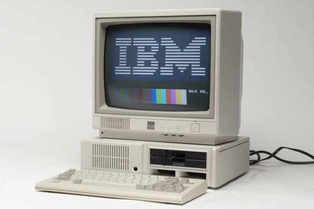

# PyClassic
Classic Computer Science Problems in Python

***
### Toc

* [1.1 The Fibonacci Sequence](notebooks/01_1_The_Fibonacci_Sequence.ipynb)
* [1.2 Trivial Compression](notebooks/01_2_Trivial_Compression.ipynb)
* [1.3 Unbreakable Encryption](notebooks/01_3_Unbreakable_Encryption.ipynb)
* [1.4 Calculating Pi](notebooks/01_4_Calculating_Pi.ipynb)
